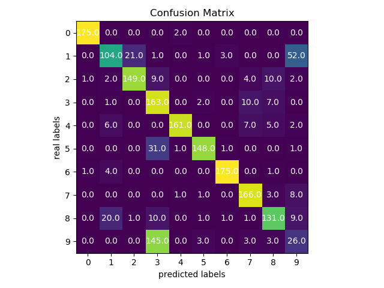

# Train K-Mean Algorithm on MNIST data set 
In this project, we will train K-mean algorithm using Sklearn library on MNIST data set.

## Note 
Before training, create a folder `data` in the current directory, download from this [link](http://archive.ics.uci.edu/ml/machine-learning-databases/optdigits/) twos data sets: `optdigits.tra` and `optdigits.tes` and place them in this folder.

## Training 
To train, run in terminal:
```
python k_mean.py
```

For customize arguments, see:
```
usage: k_mean.py [-h] [--vb {0,1}] [--init {k-means++,random,cheat}] [--n N]
                 [--n-init N_INIT] [--n-jobs N_JOBS]
                 [--algo {auto,full,elkan}] [--max-iter MAX_ITER]

Arguments to train K_Mean Algorithm.

optional arguments:
  -h, --help            show this help message and exit
  --vb {0,1}            Verbosity mode of the training.0 without verbose and 1
                        with verbose
  --init {k-means++,random,cheat}
                        The way to choose initials centroids.
  --n N                 Number of clusters.
  --n-init N_INIT       Number of time the k-means will be run with different
                        centroid seeds.
  --n-jobs N_JOBS       Number of jobs for parallel computation. Choose -1 to
                        use all available processors.
  --algo {auto,full,elkan}
                        K-mean algorithm to use.
  --max-iter MAX_ITER   Maximum number of iterations of the k-means algorithm
                        for a single run.


```
## Result
With the default arguments of the parameters, the model have 78% accuracy and the following confusion matrix.
```
Training time: 1.1831 seconds.
Arguments used for training:  {'vb': 0, 'init': 'k-means++', 'n': 10, 'n_init': 10, 'n_jobs': 2, 'algo': 'auto', 'max_iter': 300}
Prediction time: 0.0037 seconds
Accuracy: 0.7784

```



